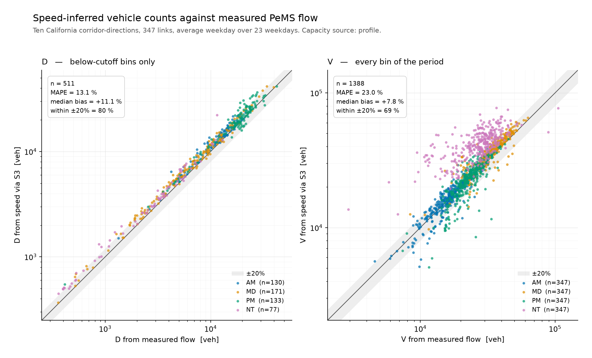

# pems-cbi-dv

Congestion episodes and period demand from freeway detector data: **D, V, P and
T2** per link per period, on ten California PeMS corridor-directions.

PeMS measures speed **and** flow at the same detector. That makes it the place
where a speed-only estimate can be checked, because both sides of the
comparison exist:

* **`_counts`** — D and V summed from the measured flow.
* **`_speed`** — D and V summed from flow inferred from speed alone, through
  the S3 fundamental diagram.

An INRIX/TMC corridor only ever supports the second. Running both here gives
the size of the gap.

| period | D MAPE | V MAPE |
|---|---:|---:|
| AM | 11.6 % | 8.7 % |
| MD | 13.2 % | 11.7 % |
| PM | 12.6 % | 11.5 % |
| NT | 16.1 % | 60.1 % |

10 corridors, 347 links, 1 388 link-periods, October 2025 average weekday.
**282 episodes** are detected; **269** are carried into the table, one per
link-period, and the other 13 are second episodes in a period that already has a
longer one. Every one of the 282 is in `outputs/pems_episodes.csv`.

D errors are computed on the **511** link-periods that contain below-cutoff
bins; the other **877** are uncongested and abstain rather than score. V errors
are computed on all 1 388.

**Column names, units and evidence layers** follow the cross-repository contract
in [`I405--FDQ-dashboard/docs/VARIABLE_CONTRACT.md`](https://github.com/jacky850/I405--FDQ-dashboard/blob/main/docs/VARIABLE_CONTRACT.md).
`D_counts`, `D_speed` and `DC_hours` are **legacy aliases** as of v0.3 — see
[`DATA_DICTIONARY.md`](DATA_DICTIONARY.md), which explains what each of them
actually is and is not. To reproduce everything below from a clean clone, see
[`REPRODUCE.md`](REPRODUCE.md).



Pooled across all four periods the figure reads D 13.1 % and V 23.0 %; the
pooled V figure is dominated by NT, which is 347 of its 1 388 points and the
only period where the estimate breaks down. Night speeds sit close to free
flow, and that is the branch of the S3 curve where a small speed difference
maps to a large flow difference. D is unaffected because it only ever sums
bins below the cutoff.

---

## Install

```bash
pip install -r requirements.txt
```

Requires `numpy`, `pandas`, `pyarrow`, `matplotlib`. Python 3.11+.

## Run

Two stages. **The second one is all you need on a fresh clone** — its inputs
are committed.

```bash
python -m pems_cbi.run table
```

writes `outputs/`. Roughly two seconds.

```bash
python -m pems_cbi.run figure
```

redraws `outputs/d_v_vs_counts.png` from the table.

```bash
python -m pems_cbi.run profiles --package <.../kaggle_release/corridors>
```

rebuilds `data/` from the raw parquet package. Roughly 90 seconds for one
month across all ten corridors; only needed to change the month, the corridor
set, or the observation filter.

Run from the repository root with `src` on the path:

```bash
PYTHONPATH=src python -m pems_cbi.run table
```

---

## Inputs

### Committed (1.1 MB, everything stage 2 needs)

| file | rows | contents |
|---|---:|---|
| `data/pems_average_weekday_5min.csv.gz` | 99 985 | `corridor, link_id, minute, speed_mph, flow_vph, n` — one average-weekday 24-hour profile per link at 5-minute resolution |
| `data/pems_link_meta.csv` | 378 | lanes, length, declared network capacity, and the raw-reading percentiles, per link (378 links pass stage 1; 347 of them also clear the 200-bin profile requirement in stage 2) |

### Not committed (needed only for stage 1)

The TrafficFlowBench five-corridor package, `data_public/kaggle_release/corridors/`:

* `<corridor>/train/mainline_states/year_month=YYYY-MM/*.parquet` — daily
  5-minute speed and flow, 2025-06 through 2026-02, ~680 MB in total
* `<corridor>/network/lwr_mainline_topology.csv` — lanes, length, link
  ordering, declared capacity

`fd_parameters.csv` is deliberately not read: only the four D12 corridors ship
it, so using it would silently produce blanks on the other six.

## Outputs

### The five quantities, and the column each one is

Everything below is in `outputs/pems_cbi_link_period.csv`, keyed by
(`corridor`, `link_id`, `period`).

| quantity | column | unit | what it is |
|---|---|---|---|
| **CBI** — the identified congestion episode | `t0_hhmm`, `T2_hhmm`, `t3_hhmm`, `window_type`, `congestion_source` | clock / label | which link-periods carry a congestion episode at all, when it runs, and whether the period owns the episode or only receives its spillover. Non-blank on 269 of the 1 388 link-periods; every episode including the ones not selected is in `pems_episodes.csv`. |
| **D** | `D_counts` / `D_speed` | veh | vehicles accumulated over the **below-cutoff bins** of the period |
| **V** | `V_counts` / `V_speed` | veh | vehicles accumulated over **every bin** of the period |
| **P** | `P_h` | hours | episode duration, `T3 − T0` |
| **T2** | `T2_hhmm` | clock | the minute of lowest speed in the episode |

`_counts` is summed from the measured PeMS flow; `_speed` from flow inferred
from speed alone. `D_err` and `V_err` are the percentage gap between the two.

Supporting columns on the same row: `v_t2_mph` and `severity` (how deep the
trough is), `mu_vph` and `mu_over_C` (discharge rate), `DC_hours` (D over
capacity, in hours), and the per-link constants `free_speed_mph`,
`cutoff_mph`, `capacity_vph` that all of the above are measured against.

### One row, read out

`D12_I5_S / L5S-185 / PM` — a 5-lane, 0.19-mile link in the Orange County
I-5 southbound PM peak:

```
free_speed_mph   72.18     cutoff_mph  50.52     capacity_vph  7453
t0_hhmm  15:45   T2_hhmm  17:20   t3_hhmm  18:25   P_h  2.67
v_t2_mph  26.45  severity  0.48   window_type  normal
mu_vph  6689     mu_over_C  0.90  DC_hours  2.48
                                measured      speed-inferred     gap
D  (32 of 48 bins below cutoff)   18 501            18 692      +1.0 %
V  (all 48 bins)                  27 965            28 363      +1.4 %
```

Read as: congestion set in at 15:45, bottomed out at 17:20 at 26 mph, and
cleared by 18:25 — 2.67 hours. 18 501 vehicles passed while it was congested,
out of 27 965 over the whole PM period. Inferring flow from speed alone would
have put those at 18 692 and 28 363.

### Files

| file | rows | contents |
|---|---:|---|
| `outputs/pems_cbi_link_period.csv` | 1 388 | the table above, one row per link × period, 34 columns |
| `outputs/pems_episodes.csv` | 282 | one row per episode, before the one-per-period selection |
| `outputs/pems_cbi_summary.json` | – | error scores by period and by corridor |
| `outputs/d_v_vs_counts.png` | – | the figure above |

Column-by-column definitions, with units and the exact computation, are in
[DATA_DICTIONARY.md](DATA_DICTIONARY.md).

---

## The chain

```
raw 5-min speed + flow
  └─ keep is_score_eligible == 1        at least 75 % real lane samples
  └─ weekdays only, average per 5-min-of-day bin
        │
        ├─ v_f      = p95  of the speed profile
        ├─ C        = p99.5 of the flow profile
        ├─ cutoff   = 0.70 × v_f
        │
        ├─ episodes = runs of speed < cutoff lasting ≥ 30 min
        │             └─ T0, T2, T3, P = T3 − T0, v_t2, mu
        │
        └─ q̂        = S3 inversion of speed, scaled by C
                      └─ D = Σ q̂ over below-cutoff bins
                         V = Σ q̂ over all bins in the period
                         (and the same two sums over measured flow)
```

Four periods cover the full day: AM 06–09, MD 09–15, PM 15–19, NT 19–06.

An episode belongs to the period holding its **T2**. Its below-cutoff bins are
counted wherever they fall, so a period can carry a non-zero D without holding
an episode; the `congestion_source` column distinguishes the two cases rather
than leaving blank geometry to be read as missing data.

---

## Corridors

`D7` is Caltrans District 7 (Los Angeles), `D12` is District 12 (Orange
County). "Links" counts those surviving the score-eligibility filter, out of
the detector-bearing mainline links in each corridor.

| corridor | links | miles | D MAPE |
|---|---:|---:|---:|
| D12_I5_N | 83 of 93 | 26.2 | 21.0 % |
| D12_I5_S | 88 of 100 | 25.9 | 14.6 % |
| D7_I210_W | 34 of 81 | 11.1 | 12.5 % |
| D7_I210_E | 30 of 75 | 8.5 | 8.2 % |
| D7_I10_W | 31 of 107 | 8.6 | 15.0 % |
| D7_I10_E | 26 of 101 | 7.4 | 6.0 % |
| D12_I405_N | 20 of 50 | 14.6 | 10.2 % |
| D12_I405_S | 13 of 44 | 13.4 | 17.9 % |
| D7_I405_N | 11 of 96 | 2.9 | 11.2 % |
| D7_I405_S | 11 of 109 | 3.4 | 14.6 % |
| **total** | **347 of 856** | **122** | |

Coverage varies widely. I-5 keeps close to 90 % of its detector links and 26
continuous miles in each direction; `D7_I405_N/S` keep about a tenth of theirs
and under 3.5 miles, so those two are a sample of links rather than a
continuous corridor.

## Episode counts

| `window_type` | episodes | |
|---|---:|---|
| `normal` | 229 | P ≤ 6 h |
| `long` | 33 | 6 h < P ≤ 8 h |
| `allday_below_cutoff` | 7 | P > 8 h |

| `congestion_source` | link-periods |
|---|---:|
| `none` | 877 |
| `own_episode` | 269 |
| `spillover_from_PM` | 135 |
| `spillover_from_AM` | 88 |
| `spillover_from_MD` | 9 |
| `spillover_from_AM+PM` | 9 |
| `spillover_from_NT` | 1 |

## Options

| flag | default | effect |
|---|---|---|
| `--months` | `2025-10` | which `year_month` partitions to average; `all` spans 2025-06…2026-02 and raises the per-bin sample from 23 to 175 weekdays |
| `--capacity-source` | `profile` | `profile`, `daily` or `network`; see DATA_DICTIONARY.md |
| `--vf-source` | `profile` | `profile` or `daily` |
| `--corridors` | all ten | restrict stage 1 |
| `--min-observations` | `10` | score-eligible weekday observations a link-bin needs to be kept |

## Layout

```
src/pems_cbi/
    config.py      every constant that defines a quantity
    profiles.py    stage 1: raw parquet -> average-weekday profile + link meta
    analysis.py    stage 2: S3 inversion, episodes, the link x period table
    figures.py     the D and V scatter
    run.py         CLI
data/              stage 1 output, stage 2 input (committed)
outputs/           stage 2 output (committed)
```
